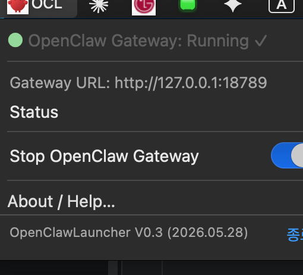

# OpenClawLauncher

macOS 메뉴바에서 **OpenClaw Gateway**를 시작/중지하고 대시보드에 빠르게 접근하는 Swift 기반 도구입니다.



## 주요 기능

- **OpenClaw Gateway 상태 표시** — 메뉴바 상단에 ● 컬러 dot으로 Running / Stopped 표시
- **Gateway URL** — 좌클릭으로 브라우저 열기, 우클릭으로 URL 복사 + 복사 완료 토스트
- **Status** — 클릭 시 메뉴를 닫지 않고 상태 즉시 새로고침
- **Start OpenClaw Dashboard** — Gateway 자동 시작 후 터미널에서 대시보드 오픈
- **Stop OpenClaw Gateway** — 슬라이드 토글 + 텍스트 클릭으로 Gateway 중지
- **로그인 시 자동 실행** — LaunchAgent 등록으로 재부팅 후에도 자동 시작
- **D2Coding 폰트 내장**

## 빌드 및 설치

```bash
./build.sh
```

이 스크립트는:

1. `Resources/AppIcon.icns` 생성 (없을 경우 openclaw favicon.svg 기반으로 자동 생성)
2. Release 빌드 수행
3. `OpenClawLauncher.app` 번들을 프로젝트 루트로 복사
4. `~/Library/LaunchAgents/com.openclawlauncher.openclaw.plist` 설치 및 로드
5. 앱 즉시 실행

## 요구사항

- macOS 14 (Sonoma) 이상
- [OpenClaw](https://openclaw.ai) CLI 설치 (`/usr/local/bin/openclaw`)
- Swift 5.9 이상

## 버전

`V0.3 (2026.05.28)`

---

by 월평동 이상목
